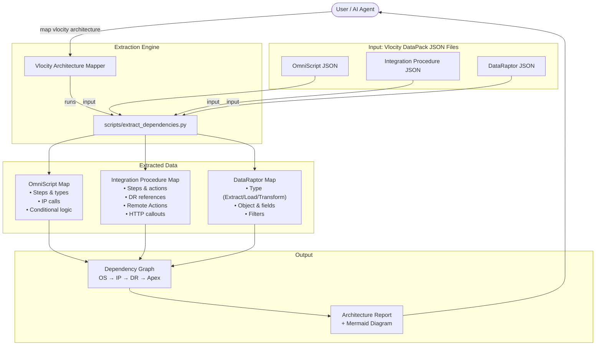
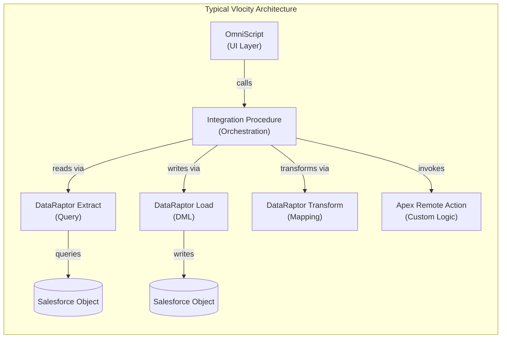
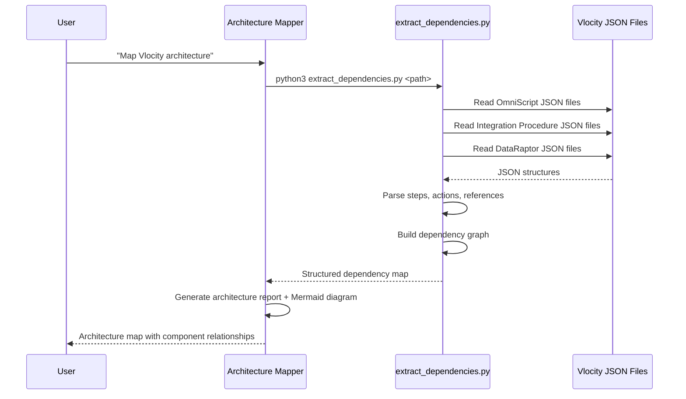

# Vlocity Architecture Mapper — Detailed Documentation

## Table of Contents
- [Overview](#overview)
- [Architecture Diagram](#architecture-diagram)
- [Requirements](#requirements)
- [How to Use](#how-to-use)
- [What to Expect](#what-to-expect)
- [Limitations](#limitations)

---

## Overview

The Vlocity Architecture Mapper extracts and maps dependencies from Vlocity/OmniStudio DataPack JSON files without loading entire files into AI context. It parses OmniScripts, Integration Procedures, and DataRaptors to build a dependency graph showing how components connect — which OmniScripts call which IPs, which IPs use which DataRaptors, and which Apex Remote Actions are invoked. This is the foundational analysis tool used by several other skills.

Vlocity/OmniStudio architectures are inherently layered. At the top, OmniScripts provide the user interface — guided wizards and forms that collect input and display results. Beneath them, Integration Procedures orchestrate business logic by chaining together multiple data operations, external callouts, and Apex Remote Actions. At the bottom, DataRaptors handle the actual data access — extracting records from Salesforce objects, loading data back, or transforming data between formats. Understanding how these layers connect is essential for making safe changes, debugging issues, and planning new features.

The challenge is that these relationships are encoded inside large JSON files that can be hundreds of kilobytes or even megabytes in size. Loading an entire OmniScript JSON file into an AI context just to find out which Integration Procedures it calls is wasteful and often impractical. The Vlocity Architecture Mapper solves this by using a lightweight Python extraction script that parses the JSON structure and pulls out only the dependency-relevant metadata — step names, types, referenced components, and configuration — without loading the full file content.

This skill is the foundation that several other skills in the repository depend on. The `salesforce-code-reviewer` uses its extraction logic to perform Vlocity-specific code reviews. The `salesforce-discovery` skill uses it during org discovery to map Vlocity component structures. The `code-orchestrator` uses it to analyze repository structure before generating implementation plans. Understanding this skill is therefore important for understanding how the entire OmniStudio skill ecosystem works together.

The typical output is a dependency graph that reads like a map: "OmniScript A calls Integration Procedure B, which uses DataRaptor C to extract data from Object D, and invokes Apex Remote Action E for custom logic." This map is invaluable for impact analysis (what breaks if I change DataRaptor C?), onboarding (how does this feature work end-to-end?), and architecture reviews (are there circular dependencies or unnecessary complexity?).

---

## Architecture Diagram



### Dependency Flow



### Data Flow



---

## Requirements

| Requirement | Details |
|---|---|
| **Python 3.x** | Required for `scripts/extract_dependencies.py` |
| **Vlocity DataPack Files** | Standard Vlocity/OmniStudio JSON files in the repository |
| **Salesforce DX Project** | Repository should follow SFDX structure with Vlocity DataPacks |

> **Note:** No additional Python packages are required. The extraction script uses only the standard library (`json`, `os`, `glob`), making it portable and easy to run on any machine with Python installed. There are no external API calls, no network dependencies, and no configuration files needed.

---

## How to Use

### Via AI Agent

The most common way to use this skill is through natural language with your AI agent:

```
"Map the Vlocity architecture"
"Show me the OmniScript dependencies"
"What Integration Procedures does this OmniScript call?"
"Build a dependency graph for the Vlocity components"
```

The agent will run the extraction script, analyze the output, and present the dependency map in a readable format with Mermaid diagrams. You can ask follow-up questions about specific components or relationships.

### Via Script

For direct execution or integration into other workflows, run the extraction script from the command line:

```bash
# Extract dependencies from all Vlocity DataPack files in a directory
python3 vlocity-architecture-mapper/scripts/extract_dependencies.py <path_to_vlocity_folder>
```

The script recursively scans the specified directory for Vlocity DataPack JSON files, parses each one, and outputs a structured dependency map to the console. The output includes component names, types, step breakdowns, and cross-component references.

For large projects with many Vlocity components, the script processes all files in seconds because it only reads the structural metadata from each JSON file, not the full content. This makes it practical to run frequently — for example, before every code review or as part of a CI/CD pipeline.

### As a Dependency of Other Skills

This skill is used internally by several other skills in the repository, and understanding this relationship helps explain why the extraction logic exists as a separate skill rather than being embedded in each consumer:

- **salesforce-code-reviewer** — Uses the extraction logic to parse Vlocity JSON files during code review, enabling checks for missing Response Actions, absent Try-Catch blocks, and hardcoded IDs without loading full JSON files into context
- **salesforce-discovery** — Uses the extraction logic during org discovery to document Vlocity component structures and build the Vlocity-to-Apex dependency map
- **code-orchestrator** — Uses the extraction logic to analyze the existing repository structure before generating implementation plans, ensuring that new code is consistent with the current architecture

By centralizing the extraction logic in this skill, all consumers benefit from the same parsing rules and stay consistent in how they interpret Vlocity DataPack structures.

---

## What to Expect

| Aspect | Details |
|---|---|
| **Output** | Structured dependency map: OmniScript → IP → DataRaptor → Apex/SObject |
| **Execution Time** | Seconds, even for large DataPack collections |
| **Context Efficiency** | Extracts only structural metadata; does not load full JSON into AI context |
| **Diagram** | Mermaid.js dependency graph showing component relationships |

The output is organized by component type. For each OmniScript, you'll see the list of steps with their types (Text Block, Input, Integration Procedure Action, DataRaptor Action, Conditional, Submit, etc.) and which Integration Procedures or DataRaptors each step references. For each Integration Procedure, you'll see the step sequence including DataRaptor references, Remote Action invocations, HTTP callout configurations, and Response Actions. For each DataRaptor, you'll see the type (Extract, Load, or Transform), the target Salesforce object, the fields being accessed, and any filter conditions.

This structured output makes it straightforward to answer common architecture questions: "What happens when a user submits this OmniScript?" (trace the step sequence through IPs and DRs), "What components will be affected if I change this DataRaptor?" (find all IPs that reference it, then all OmniScripts that call those IPs), or "Which Apex classes are invoked by Vlocity components?" (list all Remote Action references across all IPs).

The Mermaid diagram provides a visual overview that is particularly useful for architecture reviews, onboarding presentations, and Confluence documentation. The diagram can be rendered in any Markdown viewer that supports Mermaid (GitHub, Confluence, VS Code with the Mermaid extension, etc.).

### Example Output
```
=== OmniScript: CreateAccount_English ===
Steps: 6
  Step 1: Text Block (Welcome)
  Step 2: Input (Account Details) 
  Step 3: Integration Procedure Action → CreateAccount_IP
  Step 4: DataRaptor Extract Action → GetAccountTypes_DR
  Step 5: Conditional (Validation)
  Step 6: Submit

=== Integration Procedure: CreateAccount_IP ===
Steps: 4
  Step 1: DataRaptor Extract → ValidateAccount_DR
  Step 2: Remote Action → AccountService.createAccount
  Step 3: DataRaptor Load → SaveAccount_DR
  Step 4: Response Action

=== DataRaptor: ValidateAccount_DR ===
Type: Extract
Object: Account
Fields: Name, BillingCity, Industry
Filter: RecordType.DeveloperName = 'Business_Account'
```

---

## Limitations

1. **Standard DataPack Format Only** — The extraction script assumes standard Vlocity/OmniStudio JSON structure as exported by the Vlocity Build Tool or OmniStudio deployment tools. Custom or heavily modified DataPack formats, manually edited JSON files, or files from significantly older Vlocity versions may not parse correctly. If the script encounters an unexpected structure, it will skip that component and log a warning.

2. **No Runtime Validation** — The mapper analyzes static JSON files only. It does not verify that referenced components actually exist in the Salesforce org, that Remote Actions are deployed and accessible, or that DataRaptor queries return valid results. A dependency graph may show a reference to a component that has been deleted from the org but still exists in the repository.

3. **No Version Awareness** — The mapper does not distinguish between active and inactive versions of OmniScripts or Integration Procedures. If multiple versions of the same component exist in the repository, all versions will appear in the dependency map. This can lead to confusion if an older, inactive version has different dependencies than the current active version.

4. **Flat Dependency Graph** — The output shows direct dependencies only (one level deep). It does not automatically compute transitive dependency chains (e.g., OmniScript → IP → DR → another IP → another DR). To trace a full dependency chain, you need to manually follow the references across multiple components in the output.

5. **No Circular Dependency Detection** — If components reference each other in a loop (e.g., IP A calls IP B which calls IP A), the mapper does not detect or flag this. Circular dependencies are rare in well-designed Vlocity architectures but can occur in complex or poorly maintained orgs.

6. **JSON Parsing Only** — The skill reads `.json` files exclusively. It does not process Vlocity metadata in other formats (XML, YAML) or read configuration from Salesforce metadata XML files. If your Vlocity components are stored in a non-JSON format, this skill cannot analyze them.

7. **No Visual UI** — Output is text-based with optional Mermaid diagrams for visualization. There is no interactive graph visualization, no drag-and-drop interface, and no ability to filter or zoom into specific parts of the dependency graph. For interactive visualization, export the dependency data and use a dedicated graph visualization tool.

8. **Local Files Only** — The mapper works exclusively on local repository files. It does not query a live Salesforce org for component metadata, which means it can only map components that have been retrieved and stored in the local SFDX project.
