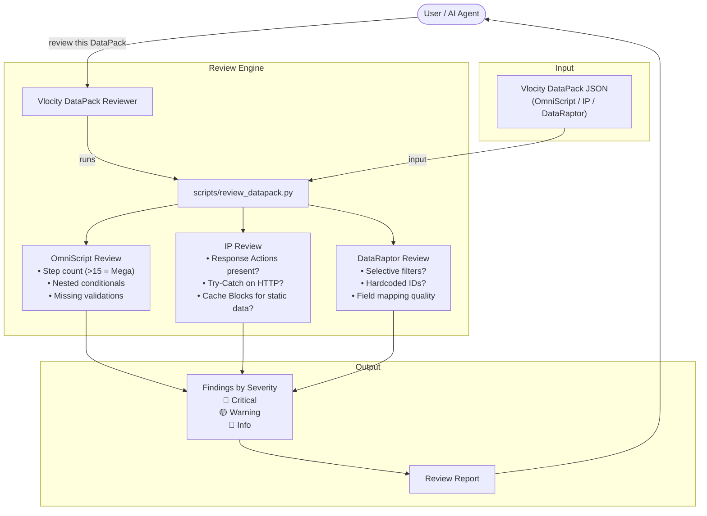
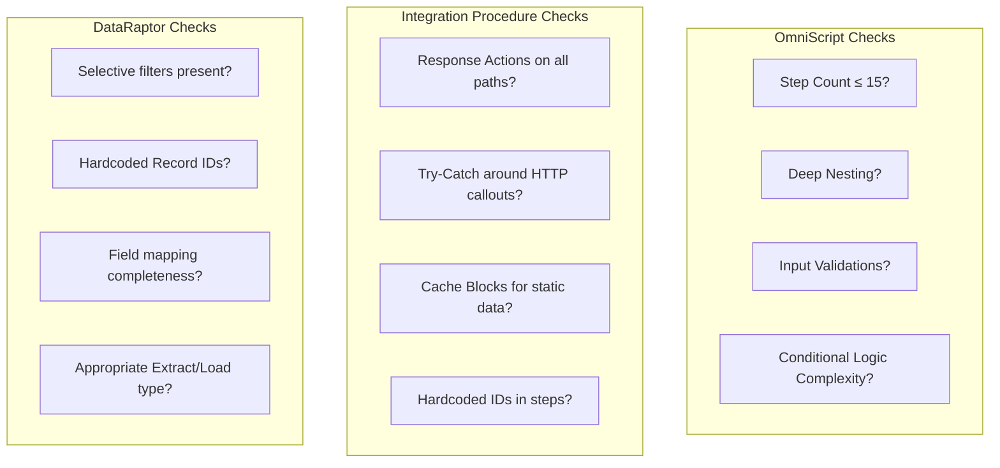
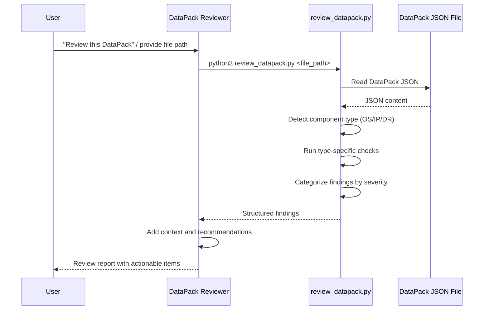

# Vlocity DataPack Reviewer — Detailed Documentation

## Table of Contents
- [Overview](#overview)
- [Architecture Diagram](#architecture-diagram)
- [Requirements](#requirements)
- [How to Use](#how-to-use)
- [What to Expect](#what-to-expect)
- [Limitations](#limitations)

---

## Overview

The Vlocity DataPack Reviewer performs deep-dive reviews of individual Vlocity/OmniStudio DataPack JSON files. Unlike the Architecture Mapper (which builds dependency graphs), this skill focuses on the internal quality of each component — checking for best practice violations, performance risks, error handling gaps, and structural issues within OmniScripts, Integration Procedures, and DataRaptors.

While the `vlocity-architecture-mapper` answers the question "how do components connect?", the Vlocity DataPack Reviewer answers "is each component well-built?" These are complementary perspectives — a component can be correctly wired into the architecture but still have internal quality issues that cause performance problems, silent failures, or maintenance headaches. For example, an Integration Procedure might be correctly referenced by an OmniScript (architecture is fine) but lack Try-Catch blocks around its HTTP callouts (internal quality is poor), meaning it will crash unpredictably when an external service is unavailable.

The skill applies a comprehensive set of checks that are derived from real-world Vlocity/OmniStudio best practices and common production issues. These checks are organized by component type because each type has its own set of quality concerns. OmniScripts are evaluated for UI complexity (step count, nesting depth, input validations). Integration Procedures are evaluated for reliability (error handling, Response Actions, caching). DataRaptors are evaluated for performance (selective filters, hardcoded IDs, field mapping completeness).

Each finding is categorized by severity — Critical issues are likely to cause production failures or data integrity problems, Warnings indicate best practice violations that increase risk, and Info findings are positive observations or minor suggestions. This severity classification helps developers prioritize their fixes: address all Critical issues before deployment, plan Warning fixes for the next sprint, and consider Info suggestions when time permits.

The skill is designed to be used during code review (either manually or as part of the `pr-reviewer` workflow), during development (to validate components before committing), or during org discovery (to assess the quality of inherited components). It complements the `salesforce-code-reviewer` skill, which handles Apex and LWC code quality, by covering the Vlocity/OmniStudio declarative layer.

---

## Architecture Diagram



### Review Checks by Component Type



### Data Flow



---

## Requirements

| Requirement | Details |
|---|---|
| **Python 3.x** | Required for `scripts/review_datapack.py` |
| **Vlocity DataPack Files** | Standard Vlocity/OmniStudio JSON files |

> **Note:** No additional Python packages are required. The review script uses only the standard library (`json`, `os`, `re`, `glob`), making it lightweight and portable. It can be run on any machine with Python installed, with no setup or configuration needed.

---

## How to Use

### Via AI Agent

The most natural way to use this skill is through conversation with your AI agent. You can point the agent at a specific file or ask it to review Vlocity components in general:

```
"Review this DataPack"
"Check the OmniScript at vlocity/OmniScript/CreateAccount.json"
"Validate the Integration Procedure"
"Are there any issues with this DataRaptor?"
```

The agent will run the review script, interpret the findings, and present them in a clear format with explanations and recommended fixes. You can ask follow-up questions about specific findings or request more detail on any issue.

### Via Script

For direct execution, batch processing, or CI/CD integration, run the review script from the command line:

```bash
# Review a specific DataPack file
python3 vlocity-datapack-reviewer/scripts/review_datapack.py <path_to_datapack_json>

# Review all DataPacks in a directory (recursively)
python3 vlocity-datapack-reviewer/scripts/review_datapack.py <path_to_vlocity_folder>
```

When pointed at a directory, the script recursively finds all Vlocity DataPack JSON files, reviews each one, and outputs a consolidated report. This is useful for reviewing all Vlocity components in a project at once — for example, as part of an initial quality assessment of an inherited org.

The script automatically detects the component type (OmniScript, Integration Procedure, or DataRaptor) from the JSON structure and applies the appropriate set of checks. You do not need to specify the component type manually.

### Integration with Other Skills

This skill is designed to work alongside other skills in the OmniStudio ecosystem:

- **vlocity-architecture-mapper** — Use the Mapper first to understand how components connect, then use the Reviewer to assess the internal quality of each component. The Mapper answers "what depends on what?" while the Reviewer answers "is each component well-built?"
- **salesforce-code-reviewer** — The Code Reviewer handles Apex and LWC quality, while the DataPack Reviewer handles Vlocity component quality. Together, they provide comprehensive coverage across both programmatic and declarative layers.
- **pr-reviewer** — When Vlocity JSON files appear in a PR diff, the PR Reviewer delegates to this skill's logic for component-level quality checks.

---

## What to Expect

| Aspect | Details |
|---|---|
| **Output** | Findings categorized as Critical, Warning, and Info |
| **Execution Time** | Seconds per DataPack file |
| **Scope** | Internal quality of individual components (not cross-component dependencies) |
| **Actionable** | Each finding includes the specific issue and a recommended fix |

The review output is designed to be immediately actionable. Each finding identifies the specific location within the component (step name, field mapping, filter condition), describes the issue in plain language, explains why it matters (what could go wrong in production), and provides a concrete recommendation for how to fix it. This format makes it easy for developers to address findings without needing to research best practices separately.

For a typical Integration Procedure with 5-10 steps, expect the review to complete in under a second and produce 0-5 findings. Well-built components may have zero findings or only Info-level observations. Components with quality issues will typically have 1-3 Critical or Warning findings that should be addressed before deployment.

The severity classification follows a consistent logic across all component types. **Critical** findings indicate issues that will cause failures in production — a missing Try-Catch around an HTTP callout means the entire Integration Procedure will crash when the external service is unavailable; a DataRaptor without selective filters will perform a full table scan that hits governor limits on large data volumes. **Warning** findings indicate issues that increase risk but may not cause immediate failures — a missing Cache Block means unnecessary SOQL queries on every execution; a hardcoded ID will break when the component is deployed to a different org. **Info** findings are positive observations or minor suggestions — confirming that the step count is within limits, or suggesting a minor structural improvement.

### Example Output
```
=== Review: CreateAccount_IP (Integration Procedure) ===

🔴 CRITICAL
- Step 3 (HTTP Action): Missing Try-Catch block around external callout
  → Wrap in Try-Catch to handle timeout/connection errors
- Step 5 (Output): No Response Action defined
  → Add Response Action to ensure consistent output structure

🟡 WARNING  
- Step 1 (DataRaptor Extract): No Cache Block configured
  → Add Cache Block (TTL: 300s) for static reference data
- Hardcoded ID found in Step 2: "001000000000ABC"
  → Replace with Custom Metadata Type or Custom Setting

🔵 INFO
- Total steps: 7 (within recommended limit of 15)
- All DataRaptor references resolve to existing components
```

### Checks Performed

| Component | Check | Severity | Why It Matters |
|---|---|---|---|
| **OmniScript** | Step count > 15 (Mega-OmniScript) | Critical | Mega-OmniScripts are slow to load, difficult to maintain, and prone to timeout errors. Split into sub-OmniScripts. |
| **OmniScript** | Deeply nested conditional logic | Warning | Deep nesting makes the OmniScript hard to debug and maintain. Flatten logic where possible. |
| **OmniScript** | Missing input validations | Warning | Without validations, invalid data flows downstream causing errors in IPs and DataRaptors. |
| **IP** | Missing Response Actions | Critical | Without a Response Action, the IP's output structure is undefined, causing unpredictable behavior in calling OmniScripts. |
| **IP** | No Try-Catch on HTTP callouts | Critical | Unhandled callout failures crash the entire IP. Try-Catch enables graceful error handling and user-friendly error messages. |
| **IP** | Hardcoded IDs in steps | Warning | Hardcoded Salesforce IDs (Record Types, Profiles, etc.) break when deployed to a different org. Use Custom Metadata instead. |
| **IP** | Missing Cache Blocks for static data | Warning | Without caching, every execution queries the same static data, wasting SOQL queries and increasing latency. |
| **DataRaptor** | No selective filters (full table scan risk) | Critical | A DataRaptor Extract without filters queries all records of the target object, hitting governor limits on large data volumes. |
| **DataRaptor** | Hardcoded Record IDs in filters | Warning | Hardcoded IDs in filter conditions break across orgs. Use dynamic values passed from the calling IP instead. |
| **DataRaptor** | Incomplete field mappings | Info | Missing field mappings may indicate that the DataRaptor is not extracting all needed data, or that unused fields should be removed. |

---

## Limitations

1. **Single-Component Focus** — The skill reviews individual DataPacks in isolation. It does not validate cross-component dependencies — for example, it cannot verify that a DataRaptor referenced by an Integration Procedure actually exists. For cross-component dependency analysis, use `vlocity-architecture-mapper`.

2. **Standard JSON Format Only** — The skill assumes standard Vlocity/OmniStudio DataPack JSON structure as exported by official tools. Non-standard formats, manually edited JSON files, or files from significantly older Vlocity versions may not parse correctly or may produce incomplete reviews.

3. **No Runtime Validation** — All checks are static, based on the JSON structure. The skill does not deploy components to a Salesforce org, execute them, or verify that they work correctly with real data. A component may pass all static checks but still fail at runtime due to data issues, permission problems, or org-specific configuration.

4. **Heuristic-Based** — Some checks use best practice heuristics rather than absolute rules. For example, the "Mega-OmniScript" threshold of 15 steps is a widely accepted guideline, but some complex business processes may legitimately require more steps. Similarly, the Cache Block recommendation assumes that the data being queried is static, which the skill cannot verify without org context.

5. **No Auto-Fix** — The skill identifies issues and recommends fixes but does not modify the DataPack JSON files. All fixes must be applied manually by the developer using the OmniStudio Designer or by editing the JSON directly. This is intentional — automated modifications to Vlocity JSON files risk breaking the component's internal structure.

6. **No Version Comparison** — The skill cannot compare two versions of the same DataPack to identify regressions (e.g., "this Response Action was present in v1 but is missing in v2"). Each review is a point-in-time assessment of the current file.

7. **Cache Block Recommendations are Advisory** — The skill flags missing Cache Blocks on DataRaptor Extract steps, but it cannot determine whether the data being queried is truly static without understanding the org's data model and update frequency. Some DataRaptors intentionally skip caching because the data changes frequently.

8. **Hardcoded ID Detection is Pattern-Based** — The skill uses regex patterns to detect Salesforce record IDs (15 or 18 character alphanumeric strings matching the Salesforce ID format). This may produce false positives for non-ID strings that happen to match the pattern, or false negatives for IDs embedded in complex expressions.
