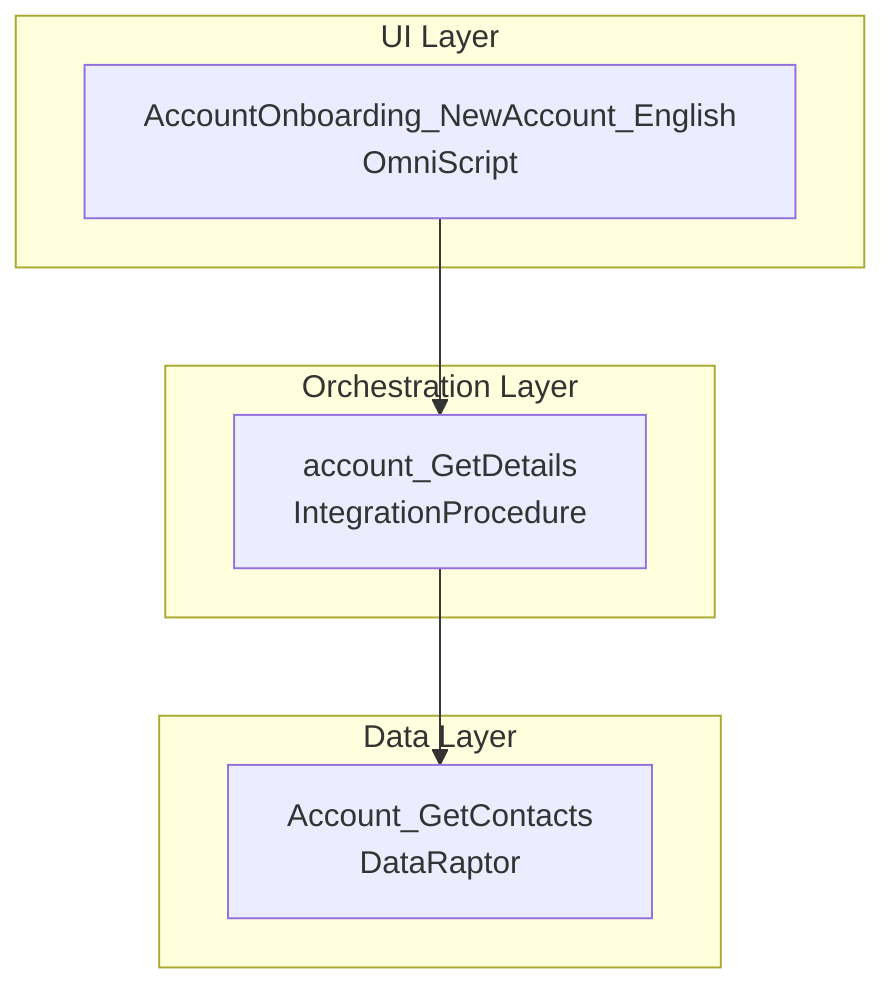

# Vlocity/OmniStudio Dependency Indexer — Full Documentation

## Table of Contents

1. [Architecture Overview](#architecture-overview)
2. [Use Cases](#use-cases)
3. [JSON Index Format](#json-index-format)
4. [Operating Modes](#operating-modes)
   - [Mode 1: --init](#mode-1--init-vlocity_dir)
   - [Mode 2: --element](#mode-2--element-indexjson-componentname--depth-n--all)
   - [Mode 3: --document](#mode-3--document-indexjson-componentname-output_dir)
   - [Mode 4: --generate-all](#mode-4--generate-all-vlocity_dir-output_dir)
   - [Mode 5: --analyze](#mode-5--analyze-vlocity_dir-element_name)
5. [Hidden Dependencies](#hidden-dependencies)
6. [Examples](#examples)
7. [Integration with Other Skills](#integration-with-other-skills)
8. [Limitations](#limitations)

---

## Architecture Overview

The Dependency Indexer solves a fundamental problem: **Other skills need instant access to accurate dependency graphs without expensive runtime parsing.**

### The Problem

- `vlocity-architecture-mapper` traces dependencies interactively but only on-demand, one component at a time
- `vlocity-pr-reviewer` and `vlocity-dev-orchestrator` perform ad-hoc exploration and often miss hidden dependencies (`preTransformBundle`, FlexCard children, etc.)
- Every skill that touches Vlocity ends up duplicating the same extraction logic

### The Solution

```
┌──────────────────────────┐
│  vlocity/ (all metadata) │
└────────────┬─────────────┘
             │
             ↓
    ┌────────────────────┐
    │  build_index.py    │  (once on init or CI/CD)
    │  --init <dir>      │
    └────────────┬───────┘
                 │
                 ↓
    ┌──────────────────────────────┐
    │ dependency-index/             │
    │  ├─ index.json (persistent)   │
    │  ├─ summary.md                │
    │  ├─ elements/                 │
    │  │  └─ Component.md           │
    │  └─ journeys/                 │
    │     └─ Component-journey.md   │
    └────────────┬──────────────────┘
                 │
     ┌───────────┼───────────┐
     ↓           ↓           ↓
[skills:]   [skills:]   [skills:]
vlocity-    salesforce- pr-
generator   code-      reviewer
            reviewer
```

Key principle: **Load and query, never rebuild.**

---

## Use Cases

### 1. Dependency Analysis for a PR

```bash
# Indexer runs once (CI/CD or user init)
python build_index.py --init vlocity/

# Reviewer skill loads index.json instantly
# → answers: "What will break if I change this component?"
```

### 2. Impact Analysis

```bash
# Build impact map: "if I modify OmniScript A, what downstream breaks?"
python build_index.py --element index.json OmniScript_A --all
```

### 3. Documentation Generation

```bash
# Create a full "journey" for stakeholders
python build_index.py --document index.json OmniScript_A docs/
# Produces: OmniScript_A-journey.md with Mermaid diagram
```

### 4. Code Generation

When `vlocity-dev-orchestrator` auto-generates code, it can load `index.json` to:
- Detect circular dependencies before generating
- Validate that all referenced components exist
- Prevent orphaned component generation

### 5. Intelligent Impact Analysis

Ask the tool to analyze a component without manually generating documentation:

```bash
# User asks: "What's the impact of changing DataRaptor X?"
python build_index.py --analyze vlocity/ DataRaptorX

# LLM response:
# ✅ Found documentation (or auto-generated it)
# 📊 Blast Radius Analysis:
#    - Direct Callers: 5 IPs
#    - Called Components: 7 DRs
#    - Risk Level: HIGH
# 📖 See journey and flow diagrams for execution details
```

The `--analyze` command:
- Checks for existing `index.json` and `manifest.json`
- Auto-generates documentation if missing
- Creates journeys and flows for the element and all transitive dependencies
- Bundles everything for LLM analysis
- Prints summary of where to find impact information

---

## JSON Index Format

### Top-Level Structure

```json
{
  "meta": {
    "generated_at": "2026-05-27T14:23:45.123456Z",
    "vlocity_dir": "/path/to/vlocity",
    "component_count": 142
  },
  "nodes": {
    "ComponentName": { /* ... node object ... */ },
    "AnotherComponent": { /* ... */ }
  }
}
```

### Node Object

```json
{
  "type": "OmniScript | IntegrationProcedure | DataRaptor | FlexCard | CalculationProcedure",
  "schema": "native | managed | unknown",
  "folder": "relative/path/from/vlocity",
  "deps": [
    {
      "target": "TargetComponentName",
      "dep_type": "IntegrationProcedure | DataRaptorExtract | DataRaptorTransform | DataRaptorLoad | FlexCard | Remote | HTTP | CalculationProcedure",
      "via_element": "NameOfElementThatCallsIt",
      "via_field": "(optional) preTransformBundle | postTransformBundle"
    }
  ]
}
```

### Example Node

```json
{
  "AccountOnboarding_NewAccount_English": {
    "type": "OmniScript",
    "schema": "native",
    "folder": "OmniScript/AccountOnboarding_NewAccount_English",
    "deps": [
      {
        "target": "account_GetDetails",
        "dep_type": "IntegrationProcedure",
        "via_element": "GetDetails_IPA"
      },
      {
        "target": "Account_GetContacts",
        "dep_type": "DataRaptorExtract",
        "via_element": "LoadContacts_DREA"
      },
      {
        "target": "MyLogger",
        "dep_type": "Remote",
        "via_element": "LogActivity_RA"
      }
    ]
  }
}
```

---

## Operating Modes

### Mode 1: `--init <vlocity_dir>`

**Purpose:** Build the complete index from scratch.

**Process:**
1. Walk the entire `vlocity_dir` directory tree
2. Discover all component folders (OmniScript, IntegrationProcedure, DataRaptor, FlexCard, CalculationProcedure)
3. For each component:
   - Detect schema (native vs managed)
   - Parse element files (or FlexCard JSON)
   - Extract 1-level dependencies
   - Check for hidden `preTransformBundle`/`postTransformBundle` fields
4. Write `dependency-index/index.json` and `dependency-index/summary.md`

**Example:**
```bash
python build_index.py --init /Users/myname/my-salesforce-dx/vlocity
```

**Output:**
```
✓ Index created: /Users/myname/my-salesforce-dx/dependency-index/index.json
✓ Summary created: /Users/myname/my-salesforce-dx/dependency-index/summary.md
✓ Total components indexed: 142
```

**Performance:** Typically 5-30 seconds for 100-300 components.

---

### Mode 2: `--element <index.json> <ComponentName> [--depth N|--all]`

**Purpose:** Traverse dependencies for a single component.

**Process:**
1. Load the pre-computed `index.json`
2. Start from the named component
3. BFS/DFS through its dependencies, tracking visited nodes
4. On circular reference, emit `[CIRCULAR → NodeName]` instead of recursing
5. Print indented tree + Mermaid diagram

**Examples:**

**Shallow (default 2 levels):**
```bash
python build_index.py --element index.json AccountOnboarding_NewAccount_English
```

**Deep (all levels):**
```bash
python build_index.py --element index.json AccountOnboarding_NewAccount_English --all
```

**Fixed depth:**
```bash
python build_index.py --element index.json AccountOnboarding_NewAccount_English --depth 3
```

**Output:**
```
--- Dependency Tree: AccountOnboarding_NewAccount_English ---

- AccountOnboarding_NewAccount_English [OmniScript]
  - GetDetails_IPA [Integration Procedure Action]
    - account_GetDetails [IntegrationProcedure]
  - LoadContacts_DREA [DataRaptor Extract Action]
    - Account_GetContacts [DataRaptor]

--- Mermaid Diagram ---

graph TD
    AccountOnboarding_NewAccount_English["AccountOnboarding_NewAccount_English<br/>OmniScript"]
    AccountOnboarding_NewAccount_English --> account_GetDetails
    account_GetDetails --> Account_GetContacts
```

---

### Mode 3: `--document <index.json> <ComponentName> <output_dir>`

**Purpose:** Generate a complete journey document with architecture diagram.

**Process:**
1. Load `index.json`
2. Traverse component with `--all` (full transitive closure)
3. Build level-by-level breakdown
4. Generate Mermaid diagram with subgraphs per layer
5. Write to `<output_dir>/<ComponentName>-journey.md`

**Example:**
```bash
python build_index.py --document index.json AccountOnboarding_NewAccount_English docs/
```

**Output file: `docs/AccountOnboarding_NewAccount_English-journey.md`**

```markdown
# AccountOnboarding_NewAccount_English

**Type:** OmniScript
**Schema:** native
**Folder:** OmniScript/AccountOnboarding_NewAccount_English

## Architecture



## Dependencies

### Level 0

| Component | Type | Referenced Via |
|-----------|------|----------------|
| AccountOnboarding_NewAccount_English | OmniScript | ... |

### Level 1

| Component | Type | Referenced Via |
|-----------|------|----------------|
| account_GetDetails | IntegrationProcedure | GetDetails_IPA |
| Account_GetContacts | DataRaptor | LoadContacts_DREA |

...
```

---

### Mode 4: `--generate-all <vlocity_dir> <output_dir>`

**Purpose:** Build complete documentation suite for all components.

**Process:**
1. Run `--init` to build the full index
2. For each Integration Procedure in the index:
   - Generate journey document with architecture diagram
   - Generate flow diagram with hierarchical component grouping
3. Create `manifest.json` with all paths and metadata

**Example:**
```bash
python build_index.py --generate-all /Users/myname/vlocity docs/
```

**Output:**
- `dependency-index/index.json` (full component graph)
- `dependency-index/journeys/*.md` (219+ journey docs, one per IP)
- `dependency-index/flows/*.md` (flow diagrams with component grouping)
- `dependency-index/manifest.json` (navigation guide)

**Performance:** ~0.5 seconds for 651 components (219 IPs documented).

---

### Mode 5: `--analyze <vlocity_dir> <element_name>`

**Purpose:** Intelligent impact analysis—check for docs, generate if needed, bundle everything for LLM.

**Workflow:**

1. **Check for documentation**
   - Looks for `index.json` and `manifest.json`
   - If missing: asks user permission and runs `--generate-all` automatically

2. **Generate element documentation**
   - Creates journey document with architecture diagram
   - Creates flow diagram (if IntegrationProcedure)

3. **Transitive analysis**
   - Traverses all child Integration Procedures
   - Generates journeys and flows for each

4. **Bundle for LLM**
   - Creates `<element_name>-analysis-bundle.json`
   - Includes all paths, dependency list, and artifact metadata

5. **Print summary**
   - Shows what was generated
   - Points to files for impact analysis

**Example:**

```bash
python build_index.py --analyze /Users/myname/vlocity sales_ProductInCatalogCheck
```

**Output:**

```
🔍 Checking for existing documentation...
✓ Found index.json and manifest.json
✓ Found component: sales_ProductInCatalogCheck

📄 Generating documentation for sales_ProductInCatalogCheck and all dependencies...
  Found 1 transitive dependencies
✓ Generated 2 documentation artifacts

📦 Creating analysis bundle for LLM...

============================================================
✅ ANALYSIS BUNDLE READY FOR LLM
============================================================

Primary Element:    sales_ProductInCatalogCheck
Component Type:     IntegrationProcedure
Total Dependencies: 2
Child Integration Procedures: 0

Documentation Generated:
  • Journeys: 1
  • Flows:    1

For LLM Impact Analysis, consult:
  1. dependency-index/index.json (full component graph)
  2. dependency-index/journeys/ (architecture diagrams)
  3. dependency-index/flows/ (execution sequences)

📖 See 'All Dependencies' section in journeys for impact analysis.
```

**Generated Files:**
- `dependency-index/journeys/<element_name>-journey.md` (architecture with all dependencies)
- `dependency-index/flows/<element_name>-flow.md` (execution flow)
- `dependency-index/journeys/<child_ip>-journey.md` (for each child IP)
- `dependency-index/flows/<child_ip>-flow.md` (for each child IP)
- `dependency-index/<element_name>-analysis-bundle.json` (metadata for LLM)

**Use Case:** When users ask "What's the impact of changing DataRaptor X?" or "How does this IP work?", this command automatically generates the complete documentation needed for LLM analysis without forcing the user to manually run multiple steps.

---

## Hidden Dependencies

The indexer automatically detects dependencies that are **not visible from the primary `Type` field** and are often missed by simpler tools.

### PreTransformBundle / PostTransformBundle

**Pattern:** An Integration Procedure step may have `preTransformBundle` or `postTransformBundle` fields that reference DataRaptors for input/output transformation.

**Example:**
```json
{
  "Name": "CreateOrder_DRE",
  "Type": "DataRaptor Extract Action",
  "PropertySetConfig": {
    "bundle": "GetOrderTemplate",
    "preTransformBundle": "ValidateInput",
    "postTransformBundle": "FormatOutput"
  }
}
```

The primary dependency is `GetOrderTemplate`, but the indexer also captures:
- `ValidateInput` (via `preTransformBundle`)
- `FormatOutput` (via `postTransformBundle`)

All three are edges in the dependency graph.

### FlexCard Child Cards

**Pattern:** A FlexCard may embed or navigate to other FlexCards via `childCards` or `openCard` actions.

**Example:**
```json
{
  "childCards": [
    { "name": "ProductDetailsCard" },
    { "name": "PricingCard" }
  ]
}
```

Both `ProductDetailsCard` and `PricingCard` are captured as dependencies.

### FlexCard DataSource IPs

**Pattern:** A FlexCard's `dataSource` may call an Integration Procedure.

**Example:**
```json
{
  "dataSource": {
    "type": "IntegrationProcedure",
    "value": {
      "ipMethod": "orders_GetProducts"
    }
  }
}
```

`orders_GetProducts` is captured as a dependency.

---

## Examples

### Example 1: Index a Salesforce DX Repository

```bash
cd /Users/myname/my-salesforce-dx
python ~/omnistudio-skills/skills/vlocity-dependency-indexer/scripts/build_index.py --init vlocity/
```

Creates:
- `dependency-index/index.json` (machine-readable)
- `dependency-index/summary.md` (human-readable stats)

### Example 2: Find All Components That Call a Specific IP

**Goal:** I modified Integration Procedure `account_GetDetails`. What OmniScripts call it?

**Query the index manually** (or write a wrapper script):

```python
import json

with open('dependency-index/index.json') as f:
    index = json.load(f)

callers = []
for comp_name, node in index['nodes'].items():
    for dep in node['deps']:
        if dep['target'] == 'account_GetDetails':
            callers.append(comp_name)

print(f"Components calling account_GetDetails: {callers}")
```

**Output:**
```
Components calling account_GetDetails: ['AccountOnboarding_NewAccount_English', 'AccountUpdate_Existing_English']
```

### Example 3: Generate Documentation for a Complex OmniScript

```bash
python build_index.py --document dependency-index/index.json \
  AccountOnboarding_NewAccount_English \
  docs/architecture/
```

Stakeholders get a single `docs/architecture/AccountOnboarding_NewAccount_English-journey.md` file showing the full flow.

### Example 4: Detect Circular Dependencies

```bash
# If IP A → IP B → IP A (circular), the output will show:
python build_index.py --element index.json IP_A --all

# Output:
# - IP_A [IntegrationProcedure]
#   - IP_B [IntegrationProcedure]
#     - IP_A [CIRCULAR]
```

---

## Integration with Other Skills

### vlocity-pr-reviewer

```python
# Load the pre-computed index instead of parsing on every PR
import json

with open('dependency-index/index.json') as f:
    index = json.load(f)

# Now use index['nodes'] to answer: "What changed in this PR?"
```

### vlocity-dev-orchestrator

When auto-generating code:
```python
# Validate that referenced components exist
for comp_name in required_components:
    if comp_name not in index['nodes']:
        raise ValueError(f"Component not found: {comp_name}")
```

### salesforce-code-reviewer

```python
# Check: "Does this Apex class's remoteClass exist in any IP?"
if apex_class not in index['nodes']:
    flag_as_orphaned(apex_class)
```

---

## Limitations

1. **1-Level Direct Dependencies Only (Initial Build)**
   - The `--init` mode captures only direct dependencies per component
   - Multi-level traversal happens on-demand via `--element` or `--document`

2. **No Version/Active Status Tracking**
   - The index does not track whether components are active or inactive
   - All components in the vlocity folder are indexed equally

3. **No Change Detection (Delta Mode Not Yet Implemented)**
   - Currently, every `--init` run scans the entire directory
   - Future enhancement: `--delta <ref>` to incrementally update based on git diff

4. **FlexCard Nested Actions Limited**
   - Complex nested action structures in `states[*].actions[*].actionList[*]` are flattened
   - Only the most direct dependency is captured (e.g., `runIP` calls)

5. **No Apex Class Discovery**
   - The indexer only traces Vlocity components
   - Custom Apex/LWC classes are not indexed (though they are referenced as `Remote` dependencies)

6. **No Environment Awareness**
   - A single index covers the entire vlocity directory
   - No support for environment-specific metadata (e.g., prod vs sandbox)

---

## FAQ

**Q: How often should I rebuild the index?**

A: Once on project setup, then incrementally on CI/CD (or manual `--init` after major syncs). Rebuild whenever you import new metadata.

**Q: Can I query the JSON index from another skill?**

A: Yes. Load `dependency-index/index.json` as raw JSON and traverse `nodes` dictionary. See examples above.

**Q: What if a dependency target doesn't exist in the index?**

A: The `--element` command will output `[NOT FOUND: TargetName]` instead of recursing. This signals broken references.

**Q: How do I detect dead code?**

A: Components in the index with zero incoming edges (not referenced by anything) are orphaned. `summary.md` lists these.

**Q: Does this replace vlocity-architecture-mapper?**

A: No. This is a complementary tool:
- **architecture-mapper:** Interactive, on-demand, single-component, human-driven
- **dependency-indexer:** Offline, persistent, full-graph, machine-readable, consumed by other skills
